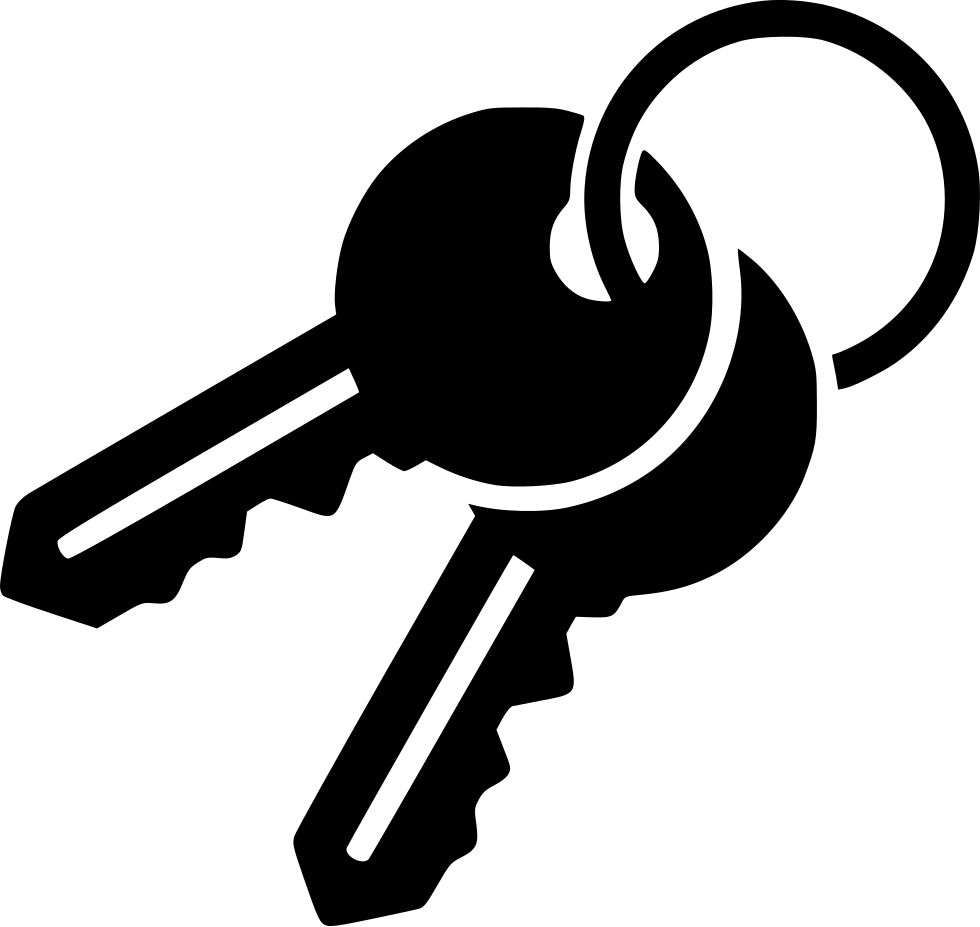

<!-- PROJECT LOGO -->
<br />
<p align="center">
  
  <h3 align="center">KeyChain</h3>
     <br />
    <br />
</p>


<!-- TABLE OF CONTENTS -->
<details open="open">
  <summary>Table of Contents</summary>
  <ol>
    <li>
      <a href="#about-the-project">About The Project</a>
    </li>
        <li> <a href="#getting-started">Getting Started</a>
      <ul>
        <li><a href="#Dependencies">Prerequisites</a></li>
        <li><a href="#installation">Installation</a></li>
      </ul>
      </li>
    <li><a href="#usage">Usage</a></li>
  </ol>
</details>


<!-- ABOUT THE PROJECT -->
## About The Project

A password application that can generate cipher, decipher and store passwords.

I started this project because I wanted to get a feeling on how to create a project with multiple different components from the ground up. From working on the project I got insight in the important things when planning and executing a project.

Its main purpose when I started was to be able to store passwords. But the longer I worked on the application the more features I added. The most interesting thing was working with the GUI's this was all new to me it was exciting and fun to learn about them.

<!-- GETTING STARTED -->
## Getting Started

### Dependencies

<!-- Dependencies -->
* Made for macOS Catalina version 10, not tested on other operating systems. 


<!-- Installation -->
### Installation

To run the program, install with git clone

   ```sh
   git clone https://github.com/jacobsvennevik/KeyChain.git
   ```

<!-- USAGE EXAMPLES -->
## Usage


After installation open the file in an editor, go to MainMenu.java in the home.GUI package and run the file. The Main menu will open and you can choose what you want to do.


![Usage Main Menu][MainMenu]

The generate password button will open another menu. Here you write how long you want the password to be and to which website the password is created for.


![Usage Generate Password][Generate]

The create password button will let you choose your own password and then save it to the website the password is for.

![Usage get Password][Get]

The get button will get the password to a website.

![Usageerrors][Error1]

The different menu's will not create or generate a password if there already exist a password to the chosen website.

![Usage errors][Error2]

Create password does not work if the password is not equal to each other.

![Usage errors][Error3]

Find Password does not work if the website does not exist


<!-- IMAGES -->
[MainMenu]: images/mainMenu.png
[Generate]: images/generate.png
[Get]: images/getPas.png
[Error1]: images/errorPas.png
[Error2]: images/passwordNotMatching.png
[Error3]: images/wrongWebsite.png

